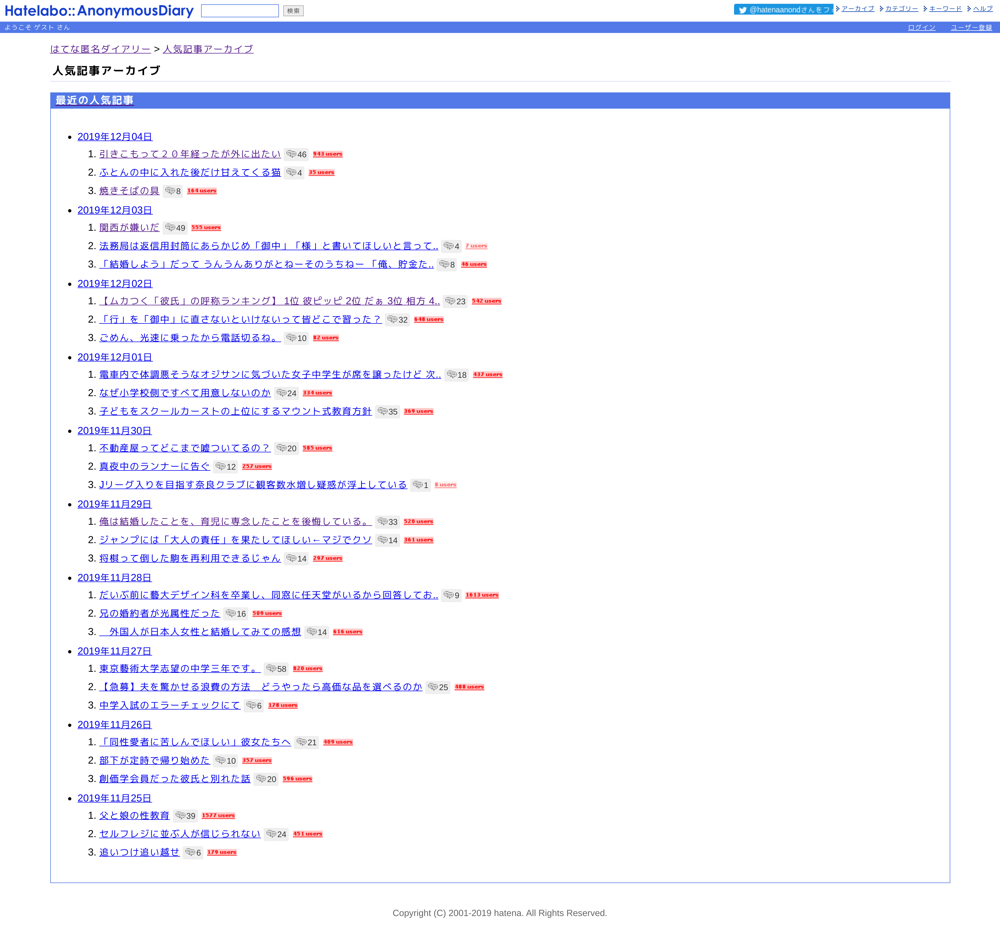

import { Card } from '@fusuma/client';

<Card
  left={}
  right={
    <>
      <h1>はてな匿名ダイアリー</h1>
      <ul>
        <li>「はてなブログ」のはてなが運営する匿名のブログサービス</li>
        <li>「最近の人気記事」を見ると雰囲気がわかる</li>
      </ul>
    </>
  }
/>