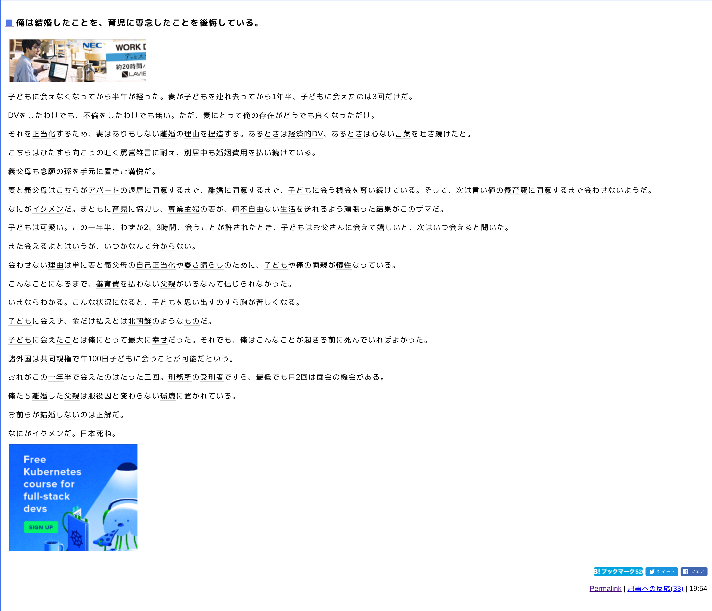

import { Card } from '@fusuma/client';

<Card
  left={}
  right={
    <>
      <h1>🤔</h1>
      <ul>
        <li>一人称代名詞が俺、"妻"について話している → 男性？</li>
        <li>かわいい子供 & ご両親がご存命 → 20代後半~30代前半？？</li>
      </ul>
    </>
  }
/>